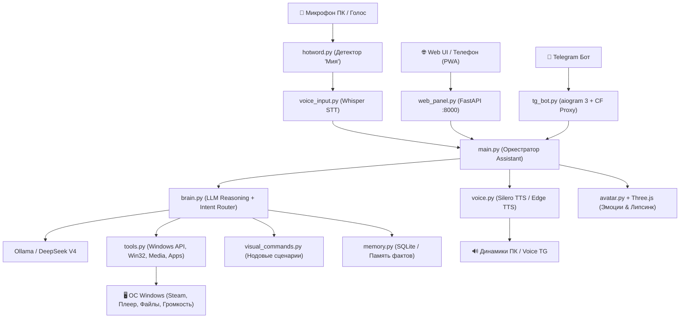

Ran command: `Get-ChildItem -Path "d:\assistant" | Select-Object Name, Length, LastWriteTime`
Viewed main.py:1-120
Viewed config.py:1-100
Viewed tools.py:1-100
Viewed tg_bot.py:1-80

# 🌟 Полное техническое описание проекта: «МИЯ (Astra / Jarvis Edition)»

> **Назначение документа:**  
> Этот документ представляет собой исчерпывающую техническую спецификацию и архитектурное руководство проекта. Он составлен так, чтобы любой разработчик или ИИ-кодер мог мгновенно погрузиться в кодовую базу, понять логику взаимодействия модулей, развернуть окружение и продолжить разработку/доработку без потери контекста.

---

## 1. Концепция и назначение проекта

**Мия** — это локальный автономный голосовой ИИ-ассистент и цифровой компаньон для Windows с визуальным интерфейсом в стиле **Astra / Jarvis / Neurona**. 

### Ключевые возможности:
1. **Голосовое управление ПК:** Фоновая активация по имени (*«Мия»*, *«Миечка»*), распознавание через локальный Whisper, быстрый синтез речи через Silero TTS (70 мс) и Edge TTS.
2. **Управление мультимедиа без потери фокуса:** Нативное переключение треков через мультимедийные клавиши Windows (`VK_MEDIA_NEXT_TRACK` / FN+F6) без сворачивания полноэкранных игр и кражи фокуса у приложений.
3. **Визуальный редактор команд (Visual Flow Engine):** Нодовый граф автоматизаций (как в Unreal Engine Blueprints / Node-RED) для создания сценариев без программирования (запуск Steam, таймеры, ссылки, системные команды).
4. **Удаленный проводник файлов ПК (Astra File Explorer):** Доступ к дискам (`C:\`, `D:\`) и папкам через браузер/смартфон с возможностью скачивания директорий целиком в `.zip` и открытия на мониторе ПК.
5. **Управление через Telegram (Вне дома):** Полноценный бот на `aiogram 3` с Cloudflare-прокси (работает в РФ без VPN), голосовыми сообщениями в обе стороны, снимками экрана и интерактивной Jarvis-панелью.
6. **Кибер-аватар (2D / 3D):** Процедурный 3D-аватар на Three.js с анимацией эмоций, липсинком (синхронизация губ при речи) и поддержкой загрузки пользовательских `.glb` / `.vrm` моделей.
7. **Двухуровневый интеллект (LLM):** Быстрая локальная модель через Ollama (`qwen2.5:3b-instruct` / `qwen2.5:7b-instruct`) для мгновенных ответов + облачный DeepSeek V4 Pro/Flash для сложного кодинга и математики.

---

## 2. Архитектура системы и поток данных



---

## 3. Детальный разбор компонентов и файлов

### 📁 1. [config.py](file:///d:/assistant/config.py) — Конфигурация и окружение
- **Модели LLM:**
  - `LLM_BASE_URL`: `http://127.0.0.1:11434/v1` (локальная Ollama).
  - `LLM_MODEL`: `qwen2.5:3b-instruct` (помещается в видеопамять 6GB GTX 1660 Super, отклик ~200 мс).
  - `DEEPSEEK_BASE_URL`, `DEEPSEEK_API_KEY`, `DEEPSEEK_MODEL`: Модели DeepSeek V4 Flash / Pro через Shanghai AI Lab Discovery API для задач кодинга и науки.
- **Telegram:**
  - `TG_TOKEN`, `ADMIN_ID`: Токен бота и ID владельца.
  - `TG_API_SERVER`: Зеркало Cloudflare Worker (`mia-bot-proxy...`), обеспечивающее бесперебойную доставку Telegram API в РФ без сторонних VPN.
  - `TG_VOICE_REPLIES`: Флаг отправки голосовых войсов в ответ пользователю.
- **Голосовые движки:**
  - `TTS_ENGINE`: `"silero"` (локальный офлайн) / `"edge"` (облачный Edge TTS).
  - `SILERO_SPEAKER`: `"xenia"` (аниме-тянка), `"aidar"` (Джарвис), `"baya"` (Мия).
  - `SILERO_SAMPLE_RATE`: 24000 Гц (синтез за 70 мс).
  - `WHISPER_MODEL`: `"small"` (оптимальный баланс точности русского языка и скорости).
  - `HOTWORD_NAMES`: `["мия", "миечка", "мика", "mia"]`.

---

### 📁 2. [main.py](file:///d:/assistant/main.py) — Главный оркестратор
- **Инициализация графической сессии Windows:**
  - Включает безопасное перенаправление потоков вывода в `mia_stdout.log` и `mia_stderr.log`.
  - Применяет вызовы Win32 API (`OpenWindowStationW("WinSta0")`, `SetThreadDesktop("Default")`), позволяя ассистенту взаимодействовать с рабочим столом, даже если он запущен из службы или неинтерактивного процесса.
- **Связка компонентов в класс `Assistant`:**
  - Инициализирует: `Memory`, `Tools`, `Brain`, `Voice`, `Ears`, `Avatar`, `ScenarioEngine`, `TGBot`, `HotwordListener`, `SystemTray`.
  - `_ensure_ollama()`: Фоновый поток, проверяющий `http://127.0.0.1:11434/api/tags` и автоматически поднимающий процесс `ollama serve`, если сервер не запущен.
  - Центральный метод `handle_user_message(text, speak, source)`: единая точка входа для сообщений из голоса, веб-панели и Telegram.

---

### 📁 3. [brain.py](file:///d:/assistant/brain.py) — Интеллект, эмоции и роутер намерений
- **Системный промпт:** Задаёт личность жизнерадостной аниме-напарницы и цифрового стримера.
- **Тегирование эмоций:** Каждый ответ классифицируется одним из тегов: `[РАДОСТЬ]`, `[СПОКОЙСТВИЕ]`, `[СМЕХ]`, `[УДИВЛЕНИЕ]`, `[СМУЩЕНИЕ]`, `[ГРУСТЬ]`, `[ЗЛОСТЬ]`, `[ЗАДУМЧИВОСТЬ]`. Тег управляет 3D-моделью и виджетами.
- **Двухуровневый роутер намерений (Гибридный Intent Router):**
  1. *Быстрый слой (Regex / Fuzzy Fallback):* Мгновенно перехватывает системные команды без траты времени на LLM:
     - Управление треками (*«следующий трек»*, *«пауза»*, *«громче»*);
     - Игровой режим (*«я хочу поиграть»*, *«запусти steam»*, *«режим игры»*) -> вызов `tool_open_steam()`;
     - Сценарии (*«включи отдых»*, *«режим фокус»*).
  2. *Интеллектуальный слой (Function Calling):* Описание инструментов `TOOLS_SPEC` передаётся в Ollama/DeepSeek. Если модель решает вызвать тул (например `open_website`, `take_screenshot`, `ask_expert_ai`), запрос диспетчеризируется в `tools.py`.

---

### 📁 4. [tools.py](file:///d:/assistant/tools.py) — Механизмы взаимодействия с ПК
- **Медиа-контроллер (`tool_media_control`):**
  - Работает через `ctypes.windll.user32.keybd_event`.
  - `0xB0` (`VK_MEDIA_NEXT_TRACK`) — аппаратный аналог FN+F6.
  - `0xB1` (`VK_MEDIA_PREV_TRACK`), `0xB3` (`VK_MEDIA_PLAY_PAUSE`), `0xB2` (`VK_MEDIA_STOP`).
  - **Преимущество:** Срабатывает за 0 мс, не перемещает курсор мыши, не сворачивает полноэкранные игры, управляет любым активным медиа-плеером Windows.
- **Яндекс Музыка (`tool_play_yandex_music`):**
  - Проверяет процесс `YandexMusic.exe`. Если запущен — отправляет сигнал `0xB3`. Если не запущен — тихо запускает в фоне без кражи фокуса.
- **Запуск программ (`tool_open_program` & `tool_open_steam`):**
  - Поддержка запуска системных утилит (`notepad`, `calc`, `taskmgr`, `explorer`).
  - Поддержка запуска Steam по URI `steam://open/main` или через Start Menu shortcut.
  - `get_installed_apps()`: Рекурсивный сканер папок `Start Menu\Programs` (общих и пользовательских) и Рабочего стола. Обнаруживает 80+ установленных программ для автодополнения в визуальном редакторе.
- **Телеметрия ПК (`tool_get_system_stats`):**
  - Замер нагрузки CPU, памяти RAM, оставшегося места на дисках `C:` и `D:`, температуры и аптайма.
- **Скриншоты и окна:**
  - `tool_take_screenshot`: Делает снимок монитора и сохраняет в `memory/screen.png`.
  - `tool_window_control`: Сворачивание всех окон (`Win+D`), закрытие текущего (`Alt+F4`), блокировка ПК (`Win+L`).

---

### 📁 5. [voice.py](file:///d:/assistant/voice.py) — Голосовой движок (TTS)
- **Silero TTS (Локальный офлайн):**
  - Загрузка модели `v4_ru.pt` через `torch.package`.
  - Кэширование аудиосемплов частых фраз в оперативную память.
  - Прямой стриминг в звуковую карту через `sounddevice` / `pygame`.
- **Edge TTS (Облачный fallback):**
  - Поддержка голосов `ru-RU-SvetlanaNeural`, `ru-RU-DmitryNeural` (Джарвис).
- **Звуковые подсказки (Audio Cues):**
  - Проигрывание коротких приятных звуковых сигналов при активации микрофона и при успешном выполнении команды (звуки из папки `sounds/`).

---

### 📁 6. [voice_input.py](file:///d:/assistant/voice_input.py) & [hotword.py](file:///d:/assistant/hotword.py) — STT и активация
- **Hotword Listener:**
  - Постоянный энергоэффективный опрос звукового потока с микрофона в отдельном демоническом потоке.
  - Фильтрация по RMS энергии звука (`HOTWORD_ENERGY_THRESHOLD = 0.009`) отсекает шум кулеров ПК и клавиатуры.
  - Распознавание имени активации (*«Мия»*, *«Миечка»*).
- **Whisper Ears:**
  - Запись буфера голоса после активации до момента тишины (VAD).
  - Локальная транскрибация через модель Whisper (`small`) в текст на русском языке.

---

### 📁 7. [web_panel.py](file:///d:/assistant/web_panel.py) — Бэкенд панели управления (FastAPI)
- **Сервер:** FastAPI + Uvicorn, порт `8000`.
- **Ключевые эндпоинты:**
  - `POST /api/chat` / `POST /api/chat_stream` — текстовый диалог с генерацией токенов в реальном времени.
  - `GET /api/system_stats` — телеметрия ПК (CPU, RAM, GPU, диски).
  - `GET /api/installed_apps` — список установленных приложений ПК для визуального редактора команд.
  - `GET /api/files/list` — просмотр содержимого дисков и папок, расчет свободного места, генерация хлебных крошек.
  - `GET /api/files/download` — прямое скачивание файла или моментальная архивация директории в `.zip` на лету.
  - `POST /api/files/open` — открытие файла или папки в Проводнике Windows на мониторе пользователя.
  - `GET / POST / DELETE /api/visual_commands` — CRUD для визуальных цепочек автоматизаций.
  - `POST /api/visual_commands/run/{id}` — выполнение нодового графа с анимацией шагов.
  - `POST /api/media` & `POST /api/remote_action` — удаленный пульт управления треками, питанием и окнами.

---

### 📁 8. [web_ui.html](file:///d:/assistant/web_ui.html) — Интерактивный фронтенд
- **Дизайн:** Полный Glassmorphism в неоновой стилистике Astra / Catppuccin Mocha.
- **Вкладки интерфейса:**
  1. `Главная (Дашборд)`: Интерактивный плеер «Моя Волна», виджеты погоды/валюты, мониторинг CPU/RAM, история запросов и чат.
  2. `Команды (Astra Command Editor)`: Холст с SVG-проводами, карточками нод (триггер -> условие -> действие -> речь), модальное окно выбора приложений ПК из 79+ найденных.
  3. `ИИ (AI Settings)`: Переключение профилей мышления, параметров генерации, эксперта DeepSeek.
  4. `Голос`: Настройка громкости, выбор спикера (Xenia / Aidar / Svetlana), чувствительность микрофона.
  5. `Модель (3D)`: Three.js вьюпорт процедурного аниме-аватара с липсинком и реакцией на движения мыши.
  6. `Файлы (ПК)`: Проводник по дискам и быстрым папкам, фильтр поиска, скачивание ZIP, открытие на ПК.
  7. `Настройки & Мобильный пульт`: PWA-пульт для телефона, инструкции подключения.

---

### 📁 9. [tg_bot.py](file:///d:/assistant/tg_bot.py) — Удаленный Telegram-ассистент
- Построен на современном асинхронном фреймворке `aiogram 3`.
- **Безопасность:** Проверка `is_admin(msg)` по `ADMIN_ID`. Неавторизованные пользователи не имеют доступа к функциям ПК.
- **Скриншоты экрана:** Команда `/screen` делает моментальный снимок экрана монитора и присылает фото в чат.
- **Голосовые диалоги:** Поддержка войсов в Telegram: бот распознает войс через Whisper и отвечает голосовым сообщением через Silero/Edge TTS.
- **Интерактивная панель `/jarvis`:** Инлайн-кнопки для управления звуком, Яндекс Музыкой, запуском сценариев и блокировкой экрана.

---

### 📁 10. [visual_commands.py](file:///d:/assistant/visual_commands.py) & [scenarios.py](file:///d:/assistant/scenarios.py)
- **JSON-схемы:** Хранятся в `scenarios/visual_flows.json` и `scenarios/*.json`.
- **Типы узлов:**
  - `trigger`: голосовая фраза, расписание, горячая клавиша.
  - `action`:
    - `open_app`: запуск программы по названию или пути;
    - `open_url`: открытие сайта в браузере;
    - `yandex_wave`: старт Моей Волны;
    - `media_control`: мультимедиа команды (FN+F6);
    - `volume`: изменение громкости;
    - `screenshot`: снимок экрана;
    - `delay`: пауза между шагами;
    - `minimize_all` / `lock_screen`: управление окнами;
    - `powershell`: произвольный скрипт PowerShell.
  - `speak`: озвучка голосового ответа Мии в конце цепочки.

---

### 📁 11. [memory.py](file:///d:/assistant/memory.py) — Система памяти
- Хранит историю последних диалогов (кратковременная память) в оперативной памяти и JSON-файле `memory/history.json`.
- Долговременная память фактов (`memory/facts.json`): хранит личные предпочтения пользователя (*«любит lo-fi»*, *«играет в CS2/Dota»*), которые подмешиваются в системный промпт.

---

## 4. Что уже реализовано и работает на 100%

| Функция | Модуль | Статус | Детали реализации |
|---|---|---|---|
| **Мультимедиа без кражи фокуса** | `tools.py` | ✅ Готово | `VK_MEDIA_NEXT_TRACK` (`0xB0`), работает как FN+F6 за 0 мс без взаимодействия с окном Яндекс Музыки. |
| **Игровой режим (Steam)** | `brain.py`, `tools.py` | ✅ Готово | Фразы *«Я хочу поиграть»*, *«запусти steam»* открывают Steam и запускают сценарий `game_mode`. |
| **Проводник файлов ПК** | `web_panel.py`, `web_ui.html` | ✅ Готово | Диски `C:`, `D:`, скачивание папок целиком в `.zip`, открытие на мониторе ПК (`/api/files/open`). |
| **Редактор команд Astra** | `visual_commands.py`, `web_ui.html` | ✅ Готово | Автосканер 79+ программ ПК, выпадающий список `open_app`, управление мультимедиа, паузы, сохранение. |
| **Telegram Companion** | `tg_bot.py` | ✅ Готово | Cloudflare прокси, войсы, инлайн-кнопки `/jarvis`, скриншоты экрана `/screen`. |
| **Фоновый микрофон** | `hotword.py`, `voice_input.py` | ✅ Готово | Активация по слову *«Мия»*, транскрибация Whisper, фильтр энергии. |
| **Голосовой синтез** | `voice.py` | ✅ Готово | Silero TTS (24 кГц за 70 мс), голоса Аниме-тянки (Xenia) и Джарвиса (Aidar). |

---

## 5. Точки доработки и задачи для следующего разработчика (To-Do Roadmap)

Если другой программист или агент возьмётся за развитие проекта, вот список приоритетных задач и улучшений:

### 1. Интеграция внешней 3D-модели (Sketchfab / GLTF / VRM)
- **Контекст:** Пользователь хотел установить 3D-модель (например, модель Юно Гасай со Sketchfab: `7c80549a4e094165acaf80c09d81c964`).
- **Где дорабатывать:** [web_ui.html](file:///d:/assistant/web_ui.html) (функция `initThreeAvatar`) и [web_panel.py](file:///d:/assistant/web_panel.py) (роут `/api/upload_mascot_3d`).
- **Что сделать:** 
  1. В `web_ui.html` настроить `GLTFLoader` Three.js для автоматического центрирования и масштабирования произвольных моделей `.glb` / `.gltf` (расчет BoundingBox и установка камеры по высоте головы).
  2. Добавить обработку костей шеи/глаз для слежения за курсором мыши (`LookAt`).

### 2. Замена Long-Polling на WebSockets для телеметрии
- **Контекст:** Сейчас статус речи аватара опрашивается через `setInterval` каждые 400 мс на `/api/avatar_status`.
- **Что сделать:** Добавить в `web_panel.py` эндпоинт `WebSocket("/ws")`, чтобы отправлять события речи, громкости звука и нажатий клавиш моментально без лишних HTTP-запросов.

### 3. Whisper VAD & Music Ducking (Акустическое эхоподавление)
- **Контекст:** Когда на ПК громко играет музыка, микрофон может улавливать эхо из колонок.
- **Что сделать:** В `hotword.py` или `voice_input.py` при активации слова «Мия» временно приглушать мастер-громкость Windows на 50% (ducking), а после завершения команды возвращать громкость обратно.

### 4. Расширение плееров для мультимедиа
- **Контекст:** Сейчас заточено под Яндекс Музыку и глобальные Windows Media клавиши.
- **Реализовано:** `Tools` содержит безопасный allow-list целей `spotify`, `aimp`, `foobar`, `yandex` и `browser`. Для обычных окон сначала используется `WM_APPCOMMAND`, затем стандартная Windows Media Session клавиша; это позволяет управлять локальными плеерами и медиа-вкладками Chromium/Firefox без внедрения кода и без произвольного запуска команд. Запуск плеера выполняется только по известным путям/URL.
- **API:** `GET /api/media/status` возвращает список установленных/запущенных целей, а `POST /api/media` и `/api/remote_action` принимают поле `player`. В визуальном редакторе значение узла может быть `spotify:next` (старый формат `next` сохраняется).
- **Ограничение:** браузерная вкладка должна уже иметь активную Media Session; управление Spotify/AIMP/foobar из UI не требует отдельного расширения Chrome.

---

## 6. Инструкция по установке и запуску

### Системные требования:
- **ОС:** Windows 10 / 11 (64-bit).
- **Python:** 3.10 или 3.11.
- **GPU (Рекомендуется):** NVIDIA с 4GB+ VRAM (GTX 1650/1660 или новее) для мгновенного инференса Ollama и Whisper.

### Установка зависимостей:
```powershell
cd D:\assistant
pip install fastapi uvicorn aiogram pywin32 pyautogui psutil sounddevice soundfile edge-tts openai faster-whisper torch torchaudio
```

### Запуск ассистента:
```powershell
python main.py
```
- Веб-панель открывается по адресу: `http://localhost:8000` (или по локальному IP с телефона, например `http://192.168.0.100:8000`).
- Логи выполнения записываются в `mia_stdout.log` и `mia_stderr.log`.
- Десктопная сборка: `D:\assistant\Mia.exe`.
